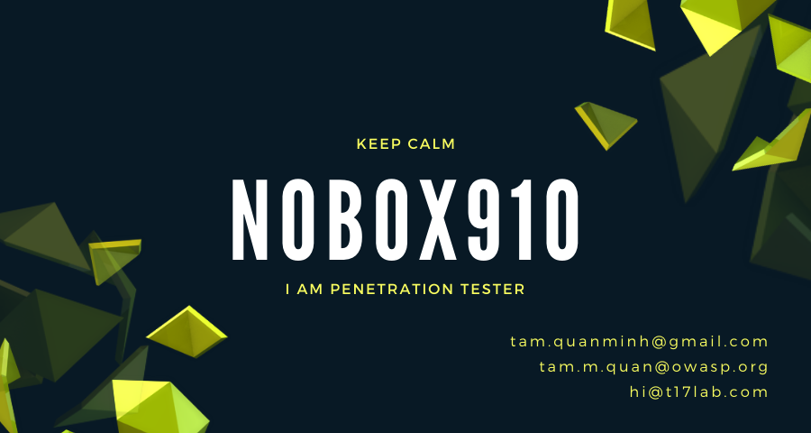

<h1 align="center">Hi 👋, I'm Tam</h1>

<i>a penetration tester</i>

I am coffee enthusiast :coffee:, a huge fan of craft beer :beers:, also a fan of Open Source :penguin: :octocat:. I live in Ho Chi Minh city, Vietnam. I worked at a big IT corporation, as well as a few small companies - some of which I even co-founded myself :office:.

- 💻 I am a Penetration Tester (Web/Mobile Application & Infra Pentest)

- 📝 I regularly write articles about Software Defined Radio (SDR) on [www2.t17lab.com](https://www2.t17lab.com)

- 📫 You can reach me via **tam.quanminh@gmail.com** || **hi@t17lab.com**

<h3 align="left">Connect with me:</h3>

<h3 align="left">Languages and Tools:</h3>

                

📕 **Latest Blog Posts**

<!-- BLOG-POST-LIST:START -->
- [Thiết bị chuyển khe sim vật lý](https://www2.t17lab.com/blog/thiet-bi-chuyen-khe-sim-vat-ly/)
- [Giới thiệu EvilCrow RF trong nghiên cứu an toàn sóng vô tuyến](https://www2.t17lab.com/blog/gioi-thieu-evilcrow-rf-trong-nghien-cuu-an-toan-song-vo-tuyen/)
- [Tấn công máy tính sử dụng Teensy HID](https://www2.t17lab.com/blog/tan-cong-may-tinh-su-dung-teensy-hid/)
- [Hướng dẫn jailbreak IPhone bằng Unc0ver](https://www2.t17lab.com/blog/huong-dan-jailbreak-iphone-bang-unc0ver/)
- [Hướng dẫn jailbreak IPhone bằng checkra1n](https://www2.t17lab.com/blog/huong-dan-jailbreak-iphone-bang-checkra1n/)
- [Can nhiễu do hệ thống máy phát thanh FM đối với hệ thống dẫn đường không lưu](https://www2.t17lab.com/blog/can-nhieu-do-he-thong-may-phat-thanh-fm-doi-voi-he-thong-dan-duong-khong-luu/)
- [Bộ ăng ten bảng tích cực băng tần L](https://www2.t17lab.com/blog/bo-ang-ten-tich-cuc-bang-tan-l/)
- [Hướng dẫn kích hoạt Bias-T trên RTL-SDR v3](https://www2.t17lab.com/blog/huong-dan-kich-hoat-bias-t-tren-rtl-sdr-v3/)
- [Thu tín hiệu bộ đàm sử dụng RTL-SDR](https://www2.t17lab.com/blog/thu-tin-hieu-bo-dam-su-dung-rtl-sdr/)
- [Tổng hợp những mã code bí mật trên điện thoại Android](https://www2.t17lab.com/blog/tong-hop-nhung-ma-code-bi-mat-tren-dien-thoai-android/)
<!-- BLOG-POST-LIST:END -->

